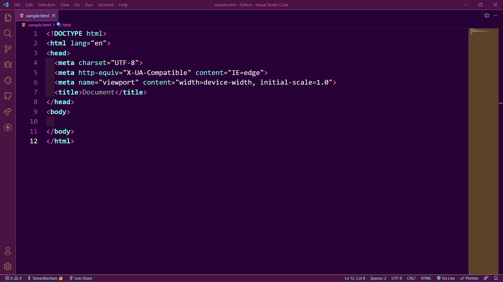
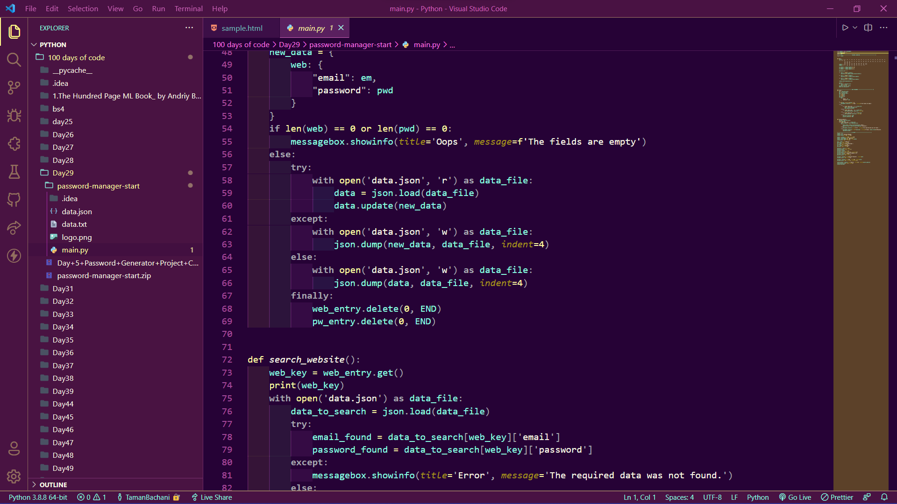

A majestic night to code it is! Let the Aurora phase through you with this beautiful stack of color, made with love for nature, for space, and for your divine desire to code! This theme is purplish, green, yellow, pink, and a pinch of yellow. My love for astronomy flows through this theme. 

